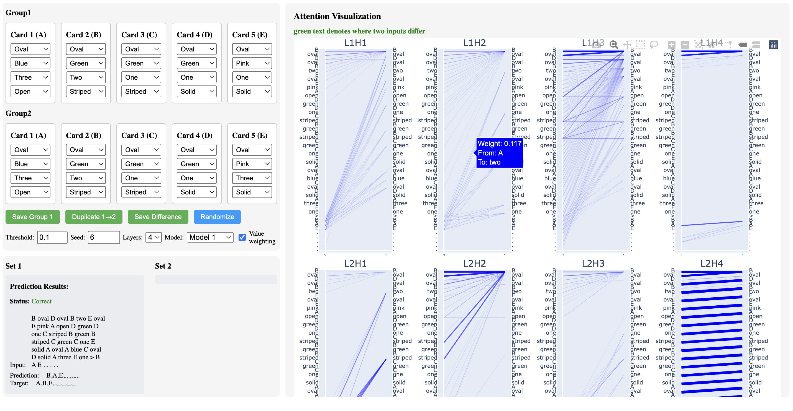
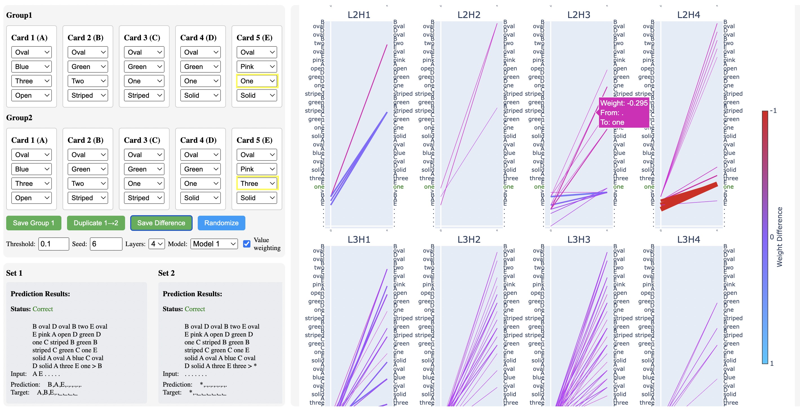

# SET Transformer
Explore relational composition and binding using toy models of the card game SET. 

Understanding if and how neural networks have the ability to reason through problems is a fundamental open question that will help us govern and evaluate the future of large language models (LLMs). In this repository, we provide code that can be used to explore the concept of binding—a crucial aspect of reasoning that examines how models relate and connect ideas to one another. 

The thesis uses toy neural networks trained on a custom task based on the **pattern-matching card game SET** to evaluate different mechanisms for [relational composition](https://arxiv.org/abs/2407.14662), a more specific notion of binding tailored to neural networks concerned with the relationship between feature vectors and if they are bound together to represent more complicated ideas.

Code developed as part of a senior thesis in Computer Science at Harvard College with the Insight and Interaction Lab. Advised by Professor Martin Wattenberg. Thank you to Andrew Lee for his advice on the transformer model. This README.md file was supplemented with generative AI tools.

Contact Hannah Zhou at hannah.g.zhou@gmail.com with any questions.

This repository can be broken into three main components:
1. `src_clean`: Main transformer model trained to play 5-card SET variant. 
    1. `new_datasets`: Different seeds of the transformer model above.
2. `flask_plot`: Visualizer web tool used to visualize attention patterns generated from transformer model.
3. `mlp`: Feed-forward neural network basic example of SET card game.


## SET Transformer Model (`src_clean`)

We outline the development of a toy model of the card game SET that is tailored
to investigate binding. We structure our SET task so the model must learn to accurately make predictions following the rules of the game while also having to perform binding in multiple different instances. Transformer architecture is heavily based on [nanoGPT](https://github.com/karpathy/nanoGPT) implementation.

The model is trained to predict if there are any sets in a random 5 card combination, and if there is a set, it also outputs the cards that participate in each set.

### Dataset Overview
We focus on detecting sets with 5 cards rather than the traditional 12 cards. With 5 cards, up to 2 sets can exist, making it the minimum for a complex non-binary game.

#### Input Format
- **Cards**: Represented by letters A, B, C, D, E
- **Attributes**: Each card has 4 attributes:
  - **Shading**: solid, striped, open
  - **Number**: one, two, three
  - **Color**: green, blue, pink
  - **Shape**: oval, squiggle, diamond
- **Structure**: Input uses discrete pairs (e.g., "A oval", "A green") rather than grouped attributes
- **Sequence**: 20 pairs (4 attributes × 5 cards) are shuffled into a sequence of length 40
- **Predict Token**: ">" marks end of input/start of output

#### Output Format
Output is always 8 characters long with padding "_" and EOS "." as needed:
- **No Sets**: "* . _ _ _ _ _ _"
- **One Set**: "A B C . _ _ _ _" (cards forming the set + EOS + padding)
- **Two Sets**: "A B C / A D E ." (first set + delimiter + second set + EOS)

### Project Structure

#### Core Model Files
- `model.py`: Contains the model architecture including the GPT implementation with attention mechanisms
- `set_transformer_small.py`: Training loop and evaluation functions for the SET model
- `main.py`: Entry point for training and testing the model

#### Data Handling
- `data_utils.py`: Utilities for data processing, including functions to generate and transform SET card combinations
- `tokenizer.py`: Implementation of a simple tokenizer for encoding/decoding card sequences
- `set_dataset.py`: Custom PyTorch dataset classes for handling SET card data

#### Analysis Tools

- Card Attribute Binding
    - `ablation.py`: Implementation of activation ablation studies to analyze how KL divergence affected
    - `classify.py`: Linear probe to test if card can be predicted from attribute and vice versa
    - `same_card_predict_from_attribute.py`: Linear probe to test if can predict that two attributes are from the same card

- Attribute Aggregation
    - `all_attribute_from_last_attribute.py`: Linear probes to test if can predict attribute aggregation from last attribute for a given card
    - `attr_from_answer.py`: Linear probes to test if can predict attributes from answer tokens in output sequence

#### Other
- `figs.py`: Functions for generating figures and visualizations, most thesis figures can be generated with methods in this file
- `mlp_fixed_output.py`: Analysis of MLP layer activations, note similarities to histograms from basic MLP/FFN section
- `all_tokenizer.pkl`: Serialized tokenizer for encoding/decoding cards

### Key Features

- **SET Game Logic**: The model is trained to identify valid sets from card combinations
- **Transformer Architecture**: Uses a GPT-style transformer with self-attention mechanisms
- **Binding Analysis**: Tools to analyze how the model binds attributes to cards and how attributes are bound together
- **Visualization**: Multiple visualization methods for attention patterns and layer activations
- **Probing**: Linear probing tools to understand the representations learned by the model

### Model Configuration

Several model configurations are available in `model.py` with different layer counts and attention heads:

- `GPTConfig44_Complete`: 4 layers, 4 attention heads
- `GPTConfig34_Complete`: 3 layers, 4 attention heads
- `GPTConfig24_Complete`: 2 layers, 4 attention heads

### Usage

1. Train the model and specify the config file: `python main.py`
2. Run any of the analysis methods 

### Requirements

- PyTorch
- NumPy
- Matplotlib
- Seaborn
- wandb (for experiment tracking)
- sklearn

## Visualizer Web Application (`flask_plot`)

This folder contains a web application for visualizing how the transformer models from above identify sets. The application allows users to select cards with different attributes, visualize attention patterns in the model, and observe how the model's predictions change with different card combinations.

To use deployed version, visit [https://set-attention-viz-322373466fab.herokuapp.com/](https://set-attention-viz-322373466fab.herokuapp.com/).

To make modifications or run locally, follow below instructions.

### Overview

The application uses a Flask backend with a transformer model implemented in PyTorch to analyze sets of cards. A set consists of three cards where for each attribute (shape, color, number, shading), all cards have either all the same value or all different values.



### Files

- **app.py**: Flask application that handles routing and API endpoints. Contains functions for processing card data, generating attention visualizations, and interfacing with the model.

- **model.py**: Contains the transformer model implementation (GPT architecture) with various configurations for different layer and head counts.

- **tokenizer.py**: Simple tokenizer for encoding/decoding sequences of card attributes.

- **index.html**: Main web interface with card selectors and visualization components.

- **requirements.txt**: Dependencies for the application.

- **runtime.txt**: Specifies Python version for deployment.

### Model Architecture

The model uses a GPT-style transformer architecture with several configurable parameters:
- 2-4 transformer layers
- 4 attention heads per layer
- 64-dimensional embeddings

### Features

1. **Card Selection**: Users can create and manipulate two groups of cards with attributes:
  - Shape (oval, squiggle, diamond)
  - Color (green, blue, pink) 
  - Number (one, two, three)
  - Shading (solid, striped, open)

2. **Attention Visualization**: Interactive visualization of attention patterns across layers and heads.

3. **Comparative Analysis**: Visualize the difference in attention patterns between two different card combinations.



4. **Configuration Options**:
  - Adjust visualization threshold
  - Change random seed for shuffling input tokens
  - Select number of model layers
  - Choose between different model variants
  - Toggle value weighting for attention visualization (color scale shows difference between first and second card groups)

### Setup and Running

1. Install dependencies: `pip install -r requirements.txt`

2. Run the application: `python app.py`

3. Access the web interface at http://localhost:8000

### Usage

1. Select card attributes using dropdown menus in the left panel
2. Use buttons to save selected cards, duplicate between groups, or randomize
3. Adjust visualization parameters as needed
4. Observe the model's predictions and attention patterns in the display area

## MLP (`mlp`)

As a motivating example for using SET as a basis for this thesis, we present a simple feed-forward
network trained to play a simulated version of the SET game.

SetNet is a basic feedforward neural network that learns to recognize valid sets. The model is trained on all possible combinations of 3 cards from all 81 cards in the deck, with positive examples being valid sets and negative examples being invalid sets.

### Features

- **Flexible Architecture**: Configurable hidden layer size to experiment with different model capacities.
- **Balanced Dataset**: Creates a balanced dataset with equal numbers of positive and negative examples.
- **Visualization Tools**: Includes functions to visualize model weights, activations, and training metrics.

### Requirements

- PyTorch
- NumPy
- Matplotlib
- scikit-learn
- wandb (for experiment tracking)
- colorcet (for visualizations)
- seaborn (for plotting metrics)

### Usage

#### Data Generation

Generate the training and validation datasets:

```python
generate_data(batch_size=16)
```

#### Training

Train a model with a specific hidden layer size:

```python
train_model(
    project="setnet",
    hidden_size=24,
    batch_size=16,
    learning_rate=1e-3,
    num_epochs=200,
    patience=10
)
```

#### Analysis

Analyze a trained model's activations:

```python
analyze_model(
    project="setnet",
    hidden_size=24,
    layer_names=["fc1", "relu1"]
)
```

Visualize model weights:

```python
plot_weight_heatmaps(
    model=None,  # Will load model from saved file
    hidden_size=24,
    project="setnet"
)
```

#### Activation Analysis

To analyze how specific neurons categorize different card attributes:

```python
# First create a non-shuffled dataloader for consistent analysis
create_analysis_dataloader(train_loader, batch_size=16)

# Get activations from a specific layer
activations = get_layer_activations(
    model,
    layer_name="fc1",
    data_loader=analysis_loader,
    save_activations_path="path/to/save/activations.pth"
)

# Plot activations grouped by card attribute
plot_activations_by_triplet_category(
    activations,
    neuron_index=1,
    dataloader=analysis_loader,
    attribute_index=2,  # 0: shape, 1: color, 2: number, 3: shading
    hidden_size=24,
    savefig=True
)
```

### Model Architecture

The SetNet model consists of:
- Input layer (36 neurons): One-hot encoded representation of three cards
- Hidden layer (configurable size)
- Output layer (1 neuron): Sigmoid activation for binary classification

### Card Encoding

Each card is encoded as a 12-dimensional one-hot vector:
- Shape (3 dims): oval, squiggle, diamond
- Color (3 dims): red, green, purple
- Number (3 dims): one, two, three
- Shading (3 dims): solid, striped, open

### Dataset

The dataset consists of all possible triplets of cards, labeled as:
- 1: Valid set
- 0: Invalid set

A valid set satisfies the condition that for each attribute, the cards either all share the same value or all have different values.

### Metrics Visualization

To plot consolidated training metrics across different hidden layer sizes:

```python
plot_consolidated_metrics(
    loss_range=[0, 0.8],
    acc_range=[0.6, 1.05],
    project_name="setnet",
    entity="your-wandb-username"
)
```
